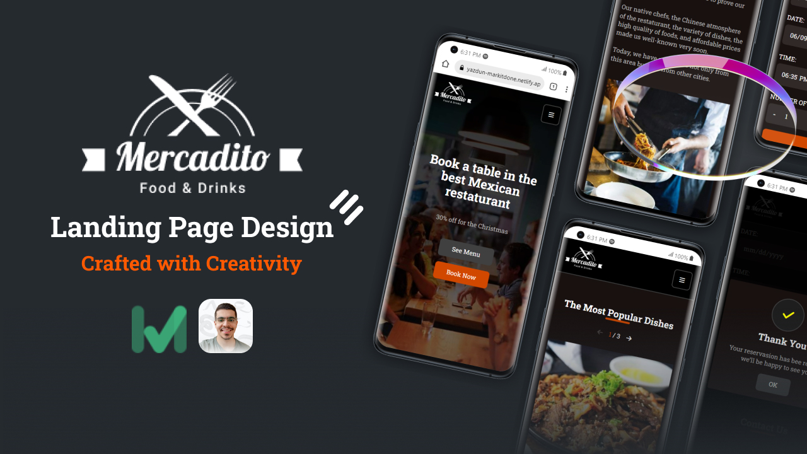

<div id="top"></div>

<!-- PROJECT LOGO -->
<br />
<div align="center">
  <a href="https://markitdone.com/">
    
  </a>

<h3 align="center">Mercadito Landing Page</h3>

  <p align="center">
    Web Developer Assessment
    <br />
    <a href="https://refact.notion.site/Web-Developer-Assessment-1b2ed30a7a0e4afdb35c9634af9a63b8"><strong>View the Task »</strong></a>
    <br />
    <br />
    <a href="https://yazdun-markitdone.netlify.app/">View Demo</a>
    ·
    <a href="https://github.com/Yazdun/markitdone-starter/pulls">Request Feature</a>
    ·
    <a href="https://github.com/Yazdun/markitdone-starter/pulls">Report Bug</a>
  </p>

[](https://developer.mozilla.org/en-US/docs/Web/HTML)
[](https://sass-lang.com/)
[](https://developer.mozilla.org/en-US/docs/Web/JavaScript)

</div>



## **Quick Lunch**

If you want have a quick start, you can start with the `dist` folder. just go to the `dist` folder and apply your changes to it. To apply changes to the content, simply open the `index.html` file and replace your text with the text. Also, to change the images, put your pictures in the image folder according to the size specified.

In the `dist` directory, in addition to the `images` folder, there are three other folders:

```
- fonts
- styles
- scripts
```

These folders include font, style, and script for landing pages. If you need to change them, just read the installation and use of landing steps.

## **Prerequisites**

You may need to install a few assets before you can get started, such as Node.

### [Node.js](https://nodejs.org)

Bring up a terminal and type `node --version`.
Node should respond with a version at or above 16.x.x.

## **Install**

Next, install the local dependencies MarkItAsDone Landing requires:

```sh
$ npm install
```

Note: if you have the [Yarn](https://yarnpkg.com/) package manager installed, you can just run `yarn`.
Landing Page includes a yarn.lock file that will be used here.

That's it! You should now have everything needed to use the MarkItAsDone Landing.

---

**You may also want to get used to some of the commands available.**

## Watch For Changes & Automatically Refresh Across Devices

```sh
$ npm start
# or
$ yarn start
```

This outputs an IP address you can use to locally test and another that can be used on devices
connected to your network.

## Build & Optimize

```sh
$ npm run build
# or
$ yarn build
```

Build and optimize the current project, ready for deployment.
This includes linting as well as image, script, stylesheet and HTML optimization and minification.

## Serve the Fully Built & Optimized Site

```sh
$ npm run demo
# or
$ yarn demo
```

This outputs an IP address you can use to locally test and another that can be used on devices
connected to your network.

---

## .babelrc

[.babelrc](https://babeljs.io/docs/usage/babelrc/) is a configuration file for passing options to [Babel](https://babeljs.io) - the ES2015 transpiler recommended for writing next-generation JavaScript in Web Starter Kit.

## .editorconfig

[EditorConfig](http://editorconfig.org/) is a file format and collection of text editor plugins for maintaining consistent coding styles between different editors and IDEs.

## gulpfile.babel.js

[Gulp](http://gulpjs.com) is a streaming build system that allows you to automate tedious development tasks. Compared with other build systems, such as Grunt, gulp uses Node.js streams as a means to automate tasks, thereby removing the need to create intermediate files when transforming source files.

In gulp, you would install plugins, that do one thing and do it well, and construct a 'pipeline' by connecting them to each other. A `gulpfile` allows you to put together tasks that use plugins to accomplish a task like minification.

`gulpfile.babel.js` is a gulpfile written in ES2015. The `babel` portion of the name refers to its use of the [Babel](https://babeljs.io) transpiler for enabling ES2015 code to run there.

## src/scripts/main.js

This is a file where your custom JavaScript can go.

## src/styles/main.scss

This is a file where your custom SCSS can go. You can place any Sass you wish to have compiled into the `styles` directory.

## src/manifest.json

`manifest.json` contains a [Web Application Manifest](https://w3c.github.io/manifest/) - a simple JSON file that gives you the ability to control how your app appears to the user in the areas that they would expect to see apps (for example the mobile home screen). In here you can control what the user can launch and more importantly how they can launch it.

For more information on the manifest, see [Web Fundamentals](https://developers.google.com/web/updates/2014/11/Support-for-installable-web-apps-with-webapp-manifest-in-chrome-38-for-Android).

## src/manifest.webapp

`manifest.webapp` refers to the proprietary [Firefox OS manifest format](https://developer.mozilla.org/en-US/Apps/Build/Manifest), and not the W3C [manifest spec](https://w3c.github.io/manifest/), designed for cross-browser open web applications.

The Firefox OS app manifest provides information about an app (such as name, author, icon, and description) and a list of Web APIs that your app needs.

This manifest included in Web Starter Kit until Firefox OS switches to using the manifest spec instead.

## package.json

A [package.json](https://docs.npmjs.com/files/package.json) file is used to specify project tooling dependencies from [npm](http://npmjs.org) - the Node package manager. When you run `npm install`, `package.json` is read to discover what packages need to be installed.

`package.json` can also contain other metadata such as a project description, version, license and configuration information.
